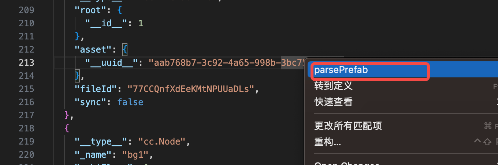
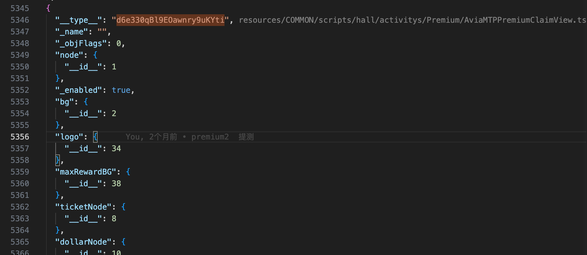
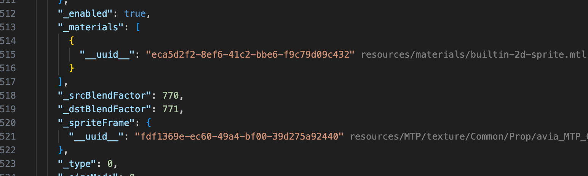
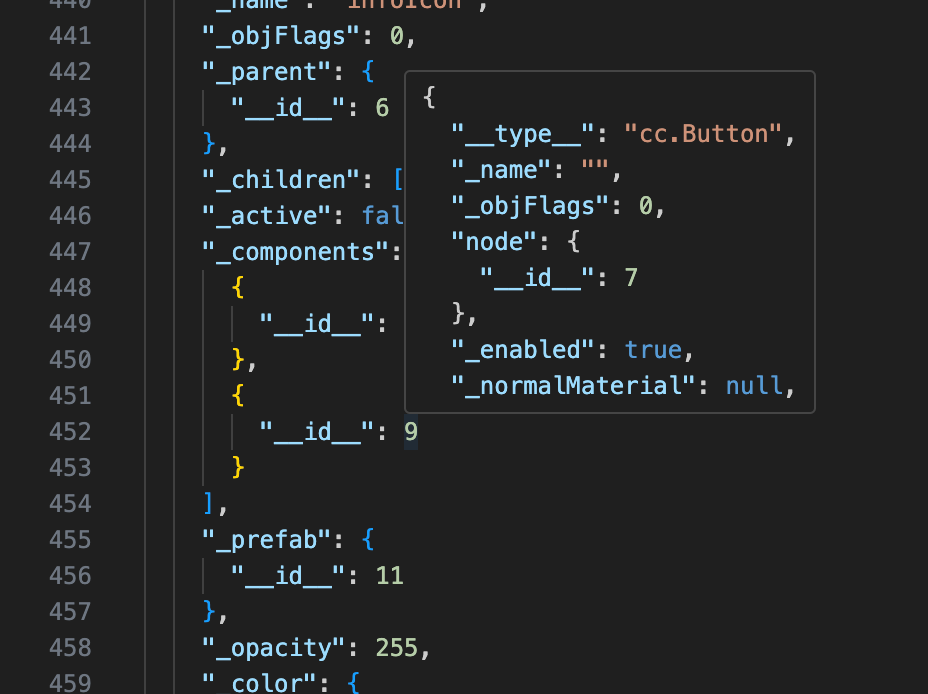

## 插件说明

本插件使用过程中不依赖creator编辑器

这个vscode插件用于解析cocos creator中的prefab和fire文件。
目前支持预制体图标标志、语法高亮、id跳转、uuid资源解析、组件hash解析。
后续将新增节点树预览，解决预制体冲突

uuid解析和组件hash解析功能依赖当前打开的是cocos creator项目目录，直白点就是依赖library目录的内容

## 版本记录

### 1.2.5

1. 支持主动刷新显示, 在预制体文件中，鼠标右键
2. 监控library目录改动，实时更新uuid解析, 组件hash解析更新
3. 支持多工作空间
   

### 1.1.9

1. 更新插件logo

### 1.1.8

1. 新增组件hash解析
   

### 1.1.5

1. 新增对uuid解析支持
   

### 1.1.1

1. 支持语法高亮
2. 支持id跳转
3. 支持显示预制体图标
4. 支持id信息预览
   
