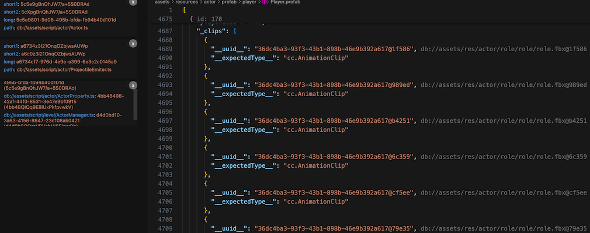

## 插件说明
1. 插件使用过程中不依赖creator编辑器
2. 插件现理论支持cocos creator 所有版本项目解析（如果发现某版本解析不了，欢迎提BUG）
3. 插件用于解析cocos creator中的prefab和fire,scene文件。
4. 目前支持预制体图标标志、语法高亮、id跳转、uuid资源解析、组件hash解析、scene场景解析。
5. 支持多工作空间解析
6. 支持资源查询，支持长uuid和短uuid查询。也支持路径反向查uuid. 路径区分大小
## 赞助商
如果本插件对您有用，可以支持一下, 谢谢 
 
感谢以下赞助商的支持 🙏
| 赞助商 | 金额 |
|--------|------|
| **云哥哥** ⭐ | 10元 |
| **峰哥** ⭐ | 10元 |
| **治亿** | 5元 |
| **冷高峰** | 5元 |

## 版本记录

### 2.2.1
1. 全面支持creator 3.x项目
2. 优化插件包体大小
3. 优化部分逻辑

### 2.0.0
1.  修复若干BUG

### 1.9.8
1. 资源uuid查询，类似GPT聊天，支持长uuid和短uuid查询。也支持路径反向查uuid. 路径区分大小
   /clear 指令所有记录
   

### 1.3.0

1. 支持引擎内置的uuid解析
   

### 1.2.8

1. 支持显示当前id, 方便手动修改引用, 少量节点引用修复不用再打开creator编辑器
   

### 1.2.5

1. 支持主动刷新显示, 在预制体文件中，鼠标右键
2. 监控library目录改动，实时更新uuid解析, 组件hash解析更新
3. 支持多工作空间
   

### 1.1.9

1. 更新插件logo

### 1.1.8

1. 新增组件hash解析
   

### 1.1.5

1. 新增对uuid解析支持
   

### 1.1.1

1. 支持语法高亮
2. 支持id跳转
3. 支持显示预制体图标
4. 支持id信息预览
   

